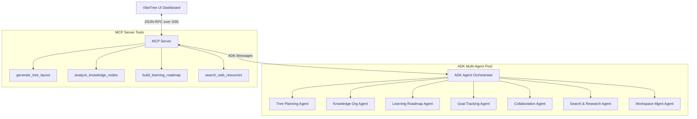

# System Architecture: ADK & MCP

VibeTree uses a federated architecture. It combines a client-side visualization layer with a backend driven by the **Model Context Protocol (MCP)** and an **ADK Multi-Agent System**.

---

## Component Diagram

---

## The 7 Specialized Agents

1. **Tree Planning Agent (TPA)**: Inspects tree structures, plans optimal layouts, and organizes complex projects into hierarchically logical child goals.
2. **Knowledge Organization Agent (KOA)**: Analyzes notes, links related nodes, suggests appropriate tags, and creates visual mappings of research logs.
3. **Learning Roadmap Agent (LRA)**: Formulates step-by-step guides. Creates customized learning milestones based on user requests and links them to external reference material.
4. **Goal Tracking Agent (GTA)**: Monitors deadline compliance, gauges completion rates, signals blocker alerts, and logs progress milestones.
5. **Collaboration Agent (CA)**: Orchestrates team edits, tracks conflicts in cursor coordinates, drafts change summaries, and alerts users of coworker changes.
6. **Search & Research Agent (SRA)**: Interfaces with public web indexes (simulated or real tools) to fetch documents, research summaries, and validation resources.
7. **Workspace Management Agent (WMA)**: Coordinates backups, exports/imports tree structures, logs version history, and checks authorization scopes.

---

## Model Context Protocol (MCP) Setup
The platform hosts a compliant MCP server that exposes tools to the multi-agent system. This decouples agent decision-making from tool execution.

### Protocol Flow
1. **Tool Discovery**: The client (or agent client) sends a `tools/list` request. The MCP Server responds with schema definitions for `generate_tree_layout`, `analyze_knowledge_nodes`, etc.
2. **Execution Request**: The agent requests the execution of a tool via `tools/call`.
3. **Result Delivery**: The MCP Server executes the local typescript handlers and returns the formatted response.
