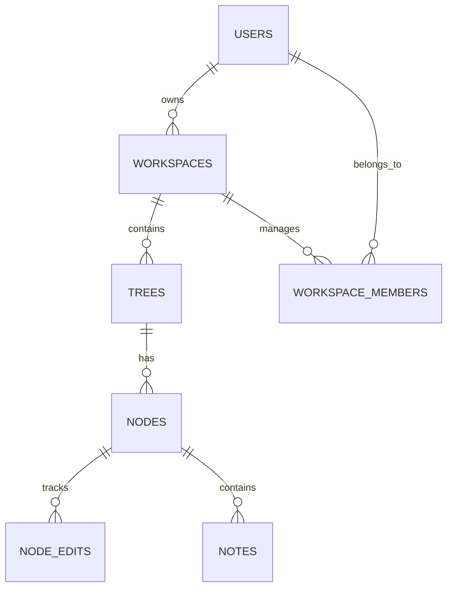

# Database Schema Specification

VibeTree uses a relational database schema designed for PostgreSQL to support trees, workspaces, nodes, and audit logs. Below is the Entity-Relationship structure and SQL DDL commands.

## Entity Relationship Diagram



## SQL Schema Definition (DDL)

```sql
-- Enable UUID extension
CREATE EXTENSION IF NOT EXISTS "uuid-ossp";

-- 1. Users Table
CREATE TABLE users (
    id UUID PRIMARY KEY DEFAULT uuid_generate_v4(),
    email VARCHAR(255) UNIQUE NOT NULL,
    password_hash VARCHAR(255) NOT NULL,
    full_name VARCHAR(100),
    avatar_url TEXT,
    role VARCHAR(50) DEFAULT 'user',
    created_at TIMESTAMP WITH TIME ZONE DEFAULT CURRENT_TIMESTAMP,
    updated_at TIMESTAMP WITH TIME ZONE DEFAULT CURRENT_TIMESTAMP
);

-- 2. Workspaces Table
CREATE TABLE workspaces (
    id UUID PRIMARY KEY DEFAULT uuid_generate_v4(),
    name VARCHAR(100) NOT NULL,
    description TEXT,
    owner_id UUID NOT NULL REFERENCES users(id) ON DELETE CASCADE,
    is_public BOOLEAN DEFAULT false,
    settings JSONB DEFAULT '{}'::jsonb,
    created_at TIMESTAMP WITH TIME ZONE DEFAULT CURRENT_TIMESTAMP,
    updated_at TIMESTAMP WITH TIME ZONE DEFAULT CURRENT_TIMESTAMP
);

-- 3. Workspace Members Table (Many-to-Many)
CREATE TABLE workspace_members (
    id UUID PRIMARY KEY DEFAULT uuid_generate_v4(),
    workspace_id UUID NOT NULL REFERENCES workspaces(id) ON DELETE CASCADE,
    user_id UUID NOT NULL REFERENCES users(id) ON DELETE CASCADE,
    role VARCHAR(50) DEFAULT 'member', -- owner, admin, member, viewer
    joined_at TIMESTAMP WITH TIME ZONE DEFAULT CURRENT_TIMESTAMP,
    UNIQUE(workspace_id, user_id)
);

-- 4. Trees Table
CREATE TABLE trees (
    id UUID PRIMARY KEY DEFAULT uuid_generate_v4(),
    workspace_id UUID NOT NULL REFERENCES workspaces(id) ON DELETE CASCADE,
    name VARCHAR(100) NOT NULL,
    description TEXT,
    created_by UUID REFERENCES users(id),
    settings JSONB DEFAULT '{"theme": "dark", "layout": "tree"}'::jsonb,
    created_at TIMESTAMP WITH TIME ZONE DEFAULT CURRENT_TIMESTAMP,
    updated_at TIMESTAMP WITH TIME ZONE DEFAULT CURRENT_TIMESTAMP
);

-- 5. Nodes Table
CREATE TABLE nodes (
    id UUID PRIMARY KEY DEFAULT uuid_generate_v4(),
    tree_id UUID NOT NULL REFERENCES trees(id) ON DELETE CASCADE,
    parent_id UUID REFERENCES nodes(id) ON DELETE SET NULL,
    title VARCHAR(255) NOT NULL,
    description TEXT,
    type VARCHAR(50) NOT NULL, -- goal, knowledge, resource, task
    status VARCHAR(50) DEFAULT 'todo', -- todo, in_progress, completed, blocked
    x_pos DOUBLE PRECISION DEFAULT 0.0,
    y_pos DOUBLE PRECISION DEFAULT 0.0,
    is_collapsed BOOLEAN DEFAULT false,
    assigned_agent VARCHAR(100), -- TreePlanningAgent, LearningRoadmapAgent, etc.
    metadata JSONB DEFAULT '{}'::jsonb,
    created_at TIMESTAMP WITH TIME ZONE DEFAULT CURRENT_TIMESTAMP,
    updated_at TIMESTAMP WITH TIME ZONE DEFAULT CURRENT_TIMESTAMP
);

-- 6. Notes Table (Rich markdown notes attached to nodes)
CREATE TABLE notes (
    id UUID PRIMARY KEY DEFAULT uuid_generate_v4(),
    node_id UUID UNIQUE NOT NULL REFERENCES nodes(id) ON DELETE CASCADE,
    content TEXT DEFAULT '',
    tags TEXT[] DEFAULT '{}',
    updated_by UUID REFERENCES users(id),
    created_at TIMESTAMP WITH TIME ZONE DEFAULT CURRENT_TIMESTAMP,
    updated_at TIMESTAMP WITH TIME ZONE DEFAULT CURRENT_TIMESTAMP
);

-- 7. Audit Log / Activity Timeline
CREATE TABLE audit_logs (
    id UUID PRIMARY KEY DEFAULT uuid_generate_v4(),
    workspace_id UUID NOT NULL REFERENCES workspaces(id) ON DELETE CASCADE,
    user_id UUID REFERENCES users(id) ON DELETE SET NULL,
    agent_name VARCHAR(100), -- populated if triggered by ADK agent
    action_type VARCHAR(100) NOT NULL, -- create_node, update_node, delete_node, invite_user
    details JSONB DEFAULT '{}'::jsonb,
    ip_address VARCHAR(45),
    created_at TIMESTAMP WITH TIME ZONE DEFAULT CURRENT_TIMESTAMP
);

-- Indexes for performance optimization
CREATE INDEX idx_workspaces_owner ON workspaces(owner_id);
CREATE INDEX idx_trees_workspace ON trees(workspace_id);
CREATE INDEX idx_nodes_tree ON nodes(tree_id);
CREATE INDEX idx_nodes_parent ON nodes(parent_id);
CREATE INDEX idx_notes_node ON notes(node_id);
CREATE INDEX idx_audit_logs_workspace ON audit_logs(workspace_id);
```

## Performance & Caching Strategy
- **Redis Caching**: Cache hot workspace trees using `vibetree:tree:<tree_id>` as the key structure. Invalidate on node additions or positional updates.
- **Node Indexes**: B-Tree indices on `tree_id` and `parent_id` speed up hierarchical tree retrievals.
